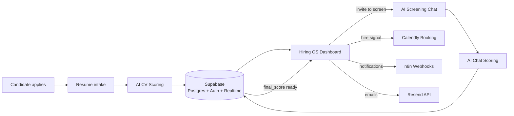
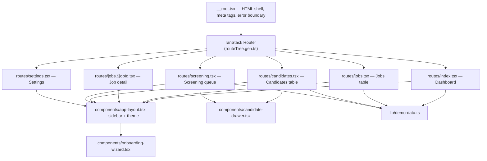

# Hiring OS — AI Candidate Screening Platform

**A white-label SaaS dashboard for recruiters to screen, score, and track candidates end-to-end — CV scoring, AI chat screening, and hiring pipeline, all in one place.**

> 🎨 Frontend is complete and fully interactive on demo data. Backend (Supabase auth, database, real-time) is scaffolded for the next phase — see [Roadmap](#-roadmap).

---

## 📖 Overview

Hiring OS is a candidate screening platform built for recruiting teams and agencies who want one dashboard to run their entire pipeline — from "job posted" to "interview scheduled" — without stitching together an ATS, a spreadsheet, and a separate AI screening tool.

Every candidate gets two scores — a **CV Score** (resume vs. job requirements) and a **Chat Score** (from an AI-driven screening conversation) — which combine into a weighted **Final Score** that recruiters use to decide who moves forward.

The product is designed to be **white-labeled**: each client sets their own company name, logo, and brand color during onboarding, and the candidate-facing side (screening chat, booking links) inherits that branding.

---

## ✨ Features

### Onboarding
A one-time 3-step **Client Setup Wizard** on first login: company branding (name, logo, brand color) → Calendly link + default hire-score threshold → shortcut to create the first job or jump straight to the dashboard.

### Dashboard
- Four top-line stats: total candidates this month, average CV score, screening completion rate, interviews scheduled.
- **Recent Activity** feed — real-time-style log of candidate events (scored, screened, interview booked) with timestamps.
- **Top Candidates This Week** — top 5 by final score across all jobs.
- **Candidate Pipeline by Stage** — a bar chart of counts across Received → Scored → Invited to Screen → Screened → Interview Scheduled → Rejected.

### Jobs
- Sortable, paginated table of every job: title, created date, applicant count, average score, scheduled count, open/closed status.
- **New Job** opens as a right-side drawer (not a modal): title, job description, CV score threshold, and hire threshold (both as sliders).
- Job Detail page with **Overview / Candidates / Settings** tabs — overview scopes the same pipeline chart and top-5 list to that single job.

### Candidates
- Global candidate table across all jobs: name, job applied, CV score, Chat score, Final score (each as a color-coded badge — green ≥70, amber 50–69, rose <50), status pill, applied date.
- Filter bar: search by name/email, filter by job, multi-select status filter, score-range slider, and **Export CSV** on the filtered view.
- **Candidate Detail Drawer** (slides in from the right, doesn't navigate away) with four tabs:
  - **Profile** — parsed resume: skills, experience, education, total years, employment gaps, red flags.
  - **Screening Chat** — the full AI ↔ candidate transcript, rendered as a real chat UI.
  - **Evaluation** — side-by-side CV Evaluation and Chat Evaluation cards (matched/unmet requirements, strengths, concerns, communication quality, motivation signal), plus the final-score formula: `CV (40%) + Chat (60%) = Final Score`.
  - **Timeline** — a vertical log of every status change with timestamp.

### Screening
Live view of everyone currently in or through screening, split into **In Progress** / **Completed** tabs — job, chat start time, message count, status. Clicking a row opens the Candidate Detail Drawer pre-scrolled to the Screening Chat tab.

### Settings
- **Branding** — logo upload with live preview, company name, brand color picker, and a preview card of the candidate-facing portal.
- **Integrations** — Calendly event URL (with a "Test Link" action), Resend API key (masked, with "Test Email"), n8n webhook base URL — each with a Connected / Not Configured status badge.
- **Scoring** — default CV and hire thresholds, and linked CV-weight/Chat-weight sliders that always sum to 100%.

### Design details
- Dark and light themes, switchable via a single toggle.
- Loading skeletons (not spinners) on every data-fetch state.
- Designed empty states for every table/list, not blank screens.
- Toast notifications for new candidates, completed screenings, and scheduled interviews.
- Every score rendered as `XX / 100` with a thin progress bar underneath.
- Optimized for desktop (min width 1280px) — this is a recruiter workstation tool, not a mobile app.

---

## 🏗️ Architecture

### Planned system architecture



*CV scoring, chat screening, and the Supabase backend are the next build phase. The current repo ships the complete frontend against realistic demo data, so the UI/UX is fully clickable and ready to wire up.*

### Frontend architecture



The app is built on **TanStack Start** (React 19 + TanStack Router) with file-based routing. `app-layout.tsx` provides the persistent sidebar and theme context around every route; `candidate-drawer.tsx` and `onboarding-wizard.tsx` are shared overlays used across multiple pages. All data currently comes from `lib/demo-data.ts` — typed to match the exact shape the eventual Supabase schema will use (see below), so swapping demo data for live queries won't require touching the UI layer.

### Planned data model

```
clients        id, company_name, brand_color, logo_url, calendly_event_url,
               hire_threshold, onboarding_complete, created_at

jobs           id, client_id (FK), title, jd_text, jd_summary,
               score_threshold, hire_threshold, status, created_at

candidates     id, job_id (FK), token, name, email, resume_url, parsed_data (jsonb),
               cv_score, cv_reasoning (jsonb), chat_transcript (jsonb), chat_score,
               chat_evaluation (jsonb), final_score, status, calendly_link, created_at
```
Row Level Security scoped so a client can only ever see rows where `client_id` matches their authenticated user.

---

## 🛠️ Tech Stack

**Framework & Routing**
- [TanStack Start](https://tanstack.com/start) (React 19) — full-stack React framework with SSR
- [TanStack Router](https://tanstack.com/router) — type-safe, file-based routing
- [TanStack Query](https://tanstack.com/query) — data fetching & caching

**UI**
- [shadcn/ui](https://ui.shadcn.com/) + [Radix UI](https://www.radix-ui.com/) primitives
- [Tailwind CSS v4](https://tailwindcss.com/)
- [Recharts](https://recharts.org/) — pipeline & stat charts
- [Lucide React](https://lucide.dev/) — icons
- [Sonner](https://sonner.emilkowal.ski/) — toast notifications
- [Vaul](https://vaul.emilkowal.ski/) — drawers (candidate detail, new job)

**Forms & Utilities**
- React Hook Form + Zod — form state & validation
- date-fns — date handling

**Planned Backend** *(not yet wired in this repo)*
- [Supabase](https://supabase.com/) — Auth, Postgres, Row Level Security, Realtime subscriptions
- [Calendly](https://calendly.com/) — interview booking
- [Resend](https://resend.com/) — transactional email
- [n8n](https://n8n.io/) — automation webhooks

**Build & Tooling**
- Vite 7 · TypeScript · ESLint · Prettier · Bun (package manager)

---

## 📂 Project Structure

```
HrScreeningSystem-main/
├── public/
│   ├── favicon.png
│   └── hiringos-logo.png
├── src/
│   ├── components/
│   │   ├── app-layout.tsx          # sidebar + theme shell
│   │   ├── candidate-drawer.tsx    # candidate detail (4 tabs)
│   │   ├── candidate-table.tsx
│   │   ├── onboarding-wizard.tsx   # 3-step first-login setup
│   │   ├── score-display.tsx       # XX/100 + progress bar
│   │   ├── status-pill.tsx
│   │   ├── empty-state.tsx
│   │   └── ui/                     # shadcn/ui component library
│   ├── lib/
│   │   ├── demo-data.ts            # typed demo dataset (matches planned schema)
│   │   ├── drawer-store.tsx
│   │   ├── theme.tsx
│   │   └── utils.ts
│   ├── routes/
│   │   ├── __root.tsx
│   │   ├── index.tsx               # Dashboard
│   │   ├── jobs.tsx                 # Jobs table
│   │   ├── jobs.$jobId.tsx          # Job detail
│   │   ├── candidates.tsx           # Candidates table
│   │   ├── screening.tsx            # Screening queue
│   │   └── settings.tsx
│   ├── router.tsx
│   └── server.ts
├── vite.config.ts
├── package.json
└── README.md
```

---

## 🚀 Getting Started

**Prerequisites:** [Bun](https://bun.sh/) (or Node.js + your package manager of choice)

```bash
# Install dependencies
bun install

# Start the dev server
bun run dev

# Build for production
bun run build

# Preview the production build locally
bun run preview
```

The dev server runs at `http://localhost:3000` by default.

---

## 🗺️ Roadmap

- [ ] Wire up Supabase (Auth, Postgres schema, Row Level Security)
- [ ] Supabase Realtime subscriptions on `candidates` for live dashboard/table updates
- [ ] Resume parsing + AI CV scoring pipeline
- [ ] AI screening chat + chat scoring pipeline
- [ ] Calendly and Resend integrations (currently UI-only in Settings)
- [ ] n8n webhook wiring for automation triggers

---

## 👤 Author

Built by **Fhiroj Shaik** — Founder, MOFI AI. I build AI agents, voice AI systems, and n8n-powered automation for real businesses.

🔗 **LinkedIn:** [linkedin.com/in/fhiroj-shaik-020760355](https://www.linkedin.com/in/fhiroj-shaik-020760355/)
